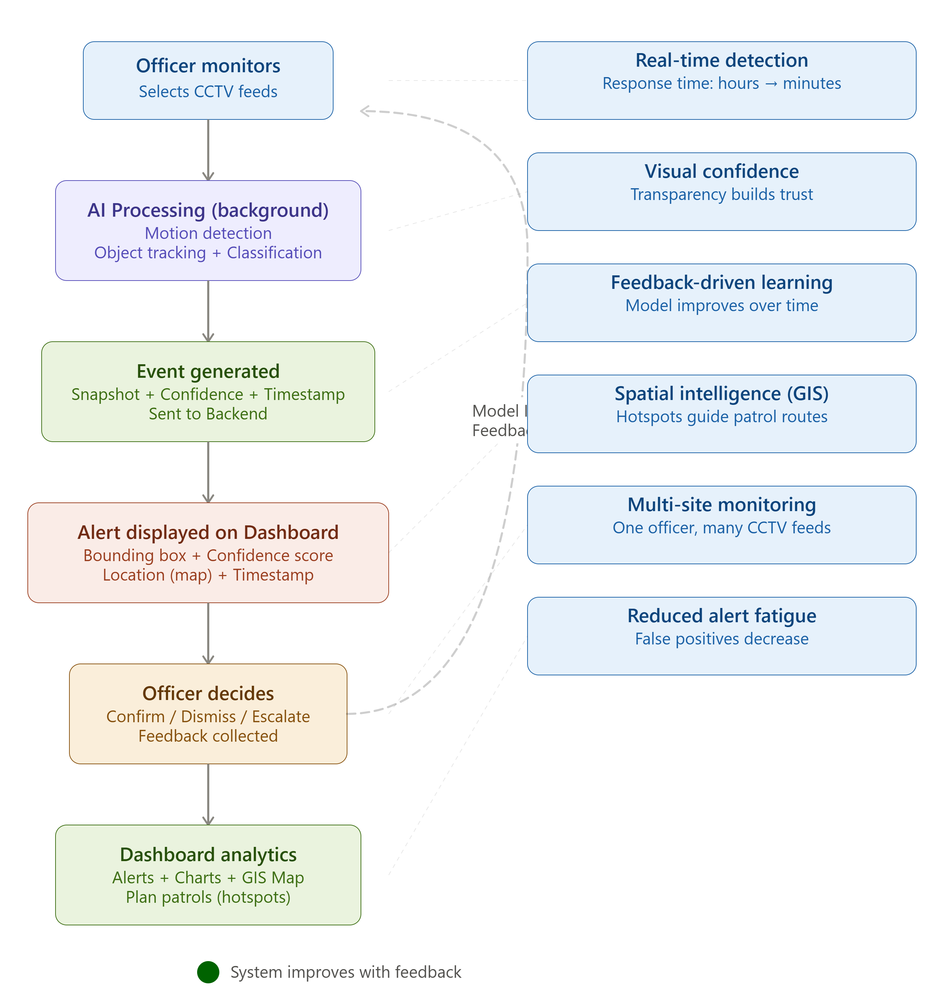

# 🧠 AI-Powered Environment Monitoring System

An AI-based real-time monitoring system designed to detect illegal dumping using CCTV video streams. The system combines computer vision, deep learning, and a modular backend to generate alerts and provide actionable insights through a dashboard.

---

## 📋 Table of Contents

- [Overview](#-overview)
- [Key Features](#️-key-features)
- [System Pipeline](#️-system-pipeline)
- [System Architecture](#️-system-architecture)
- [Development Methodology](#development-methodology)
  - [CDIO Phases](#cdio-phases)
  - [Project Management](#project-management)
- [User Journey](#user-journey)
- [Tech Stack](#️-tech-stack)
- [Installation](#️-installation)
- [Usage](#️-usage)
- [Project Structure](#-project-structure)
- [Version Evolution](#-version-evolution)
- [Evaluation](#evaluation)
  - [Evaluation Methodology](#evaluation-methodology)
  - [Performance Metrics](#performance-metrics)
  - [Key Findings](#key-findings)
  - [Analysis](#analysis)
- [Testing](#-testing)
- [Ethical Considerations](#️-ethical-considerations)
- [Impact](#-impact)
- [Future Improvements](#-future-improvements)
- [Authors](#‍-authors)
- [License](#-license)

---

## 🚀 Overview

Illegal dumping is a growing urban issue causing environmental damage and increased operational costs.

This project presents a real-time AI-powered monitoring system that transforms CCTV into an intelligent detection tool.

By combining computer vision and deep learning, the system automatically detects illegal dumping events, generates alerts, and provides actionable insights through a dashboard.

---

## ⚙️ Key Features

* 🎥 Real-time CCTV video processing
* 🧠 Motion detection and object tracking
* 🗑️ Waste classification using MobileNetV3
* ⚡ Event detection and alert generation
* 🌐 Backend API with Flask
* 📊 Interactive dashboard (Streamlit)
* 🗺️ GIS-based visualisation

---

## 🏗️ System Pipeline

1. Video input from CCTV
2. Motion detection filters frames
3. Object tracking monitors behaviour
4. Stationary objects are classified
5. Waste detection triggers event
6. Event sent to backend
7. Dashboard updates in real time

---

## 🏗️ System Architecture


---

## 🧩 Project Architecture Diagram


---

## Development Methodology

This project was developed over **5.5 months** using the **CDIO (Conceive-Design-Implement-Operate) framework** combined with **Agile Project Management**.

### CDIO Phases

**Conceive Phase**
- Identified illegal dumping as a key issue
- Defined system requirements with stakeholders
- Goal: real-time automated detection

**Design Phase**
- Developed the system architecture for monitoring
- Motion detection and object tracking as the approach
- MobileNetV3 to classify objects as waste or non-waste
- Event generation (timestamp, confidence, snapshot)
- Backend system integration
- Dashboard for visualising alerts, trends, and GIS data

**Implementation Phase**
- Model detects litter in real time
- Detected objects shown with label and confidence
- Events logged on the dashboard
- Multiple CCTV feeds demonstrate simultaneous detection and alerts

**Results & Evaluation**
- Full CCTV pipeline evaluated using 3 real-world test videos
- System performance measured using event-based detection metrics
- Model achieved:
  - Accuracy: 75%
  - Recall: 60% (detects most trash events)
  - Precision: 21% (many false alarms)

**Operate Phase**
- Detected events displayed on dashboard with confidence score, timestamp, and snapshot
- Real-time monitoring of CCTV feeds
- Alerts generated for detected waste
- GIS visualisation of detected waste locations

### Project Management

- **Agile development** with iterative sprints
- **Modular Approach**: AI, backend, dashboard
- **Continuous testing** ensured reliability

---

## User Journey



The system operates through a continuous, officer-driven feedback loop:

1. **Monitor** — Officer selects CCTV feeds on the dashboard
2. **AI Processing** — Motion detection, object tracking, and classification run continuously in the background
3. **Event Generated** — When waste is detected, an event is created with a snapshot, confidence score, timestamp, and GIS location
4. **Alert Displayed** — The dashboard shows a real-time alert with a red bounding box, confidence score, and incident location
5. **Officer Decides** — Officer reviews the alert and chooses to confirm (true positive), dismiss (false alarm), or escalate (hazardous)
6. **Model Improves** — Dismissed alerts are collected as retraining data, reducing false positives over time

This feedback loop is critical: the system learns from officer decisions, enabling continuous improvement. As false alerts decrease, officers gain confidence in the system, and patrol routes are optimized based on detected hotspots shown on the GIS map.

---

## 🛠️ Tech Stack

* **Programming:** Python
* **Computer Vision:** OpenCV
* **AI Framework:** PyTorch + torchvision (MobileNetV3)
* **Backend:** Flask (REST API, MJPEG streaming, SSE)
* **Version Control:** Git & GitHub

---

## ▶️ Installation

```bash
git clone https://github.com/syedahmadbokhari/AI-for-Environmental-Monitoring-and-Urban-Planning.git
cd AI-for-Environmental-Monitoring-and-Urban-Planning
pip install -r requirements.txt
```

---

## ▶️ Usage

Run the standalone CLI demo (single video file):

```bash
python main.py --video videos/video.mp4 --model models/best_model.pth
```

Run the Flask backend (multi-camera dashboard):

```bash
python dashboard/app.py --model models/best_model.pth
```

Then open `http://localhost:5000` in your browser.

---

## 📁 Project Structure
ai-for-environmental-monitoring-and-urban-planning/

│

├── core/                    # Core detection modules

│   ├── init.py

│   ├── classifier.py        # MobileNetV3 inference

│   └── pipeline.py          # 4-stage detection pipeline + CameraPipeline

│

├── dashboard/               # Flask backend + frontend

│   └── app.py               # REST API + MJPEG streams + SSE events

│

├── data/                    # Dataset (raw + processed)

├── diagrams/                # System architecture diagrams

├── docs/                    # Design, evaluation, ethics, PM documents

├── logs/                    # Runtime event logs

├── models/                  # Trained model checkpoints (MobileNetV3)

├── training/                # Model training scripts (train.ipynb)

├── videos/                  # Input video files (add your own here)

│

├── archive/                 # Prototype versions v0–v7 (historical reference)

│

├── config.yaml              # Central configuration (all tunable parameters)

├── main.py                  # CLI demo entry point (single video)

├── requirements.txt

└── README.md

---

## 🔄 Version Evolution

| Version | Description |
|---------|-------------|
| v0 | Initial concept and basic pipeline setup |
| v1 | Motion detection implemented |
| v2 | Object tracking introduced |
| v3 | Dashboard integration |
| v4 | Backend system (Flask API) developed |
| v5 | Event detection and alert system refined |
| v6 | Optimised real-time system |
| v7 | Dataset tooling, YOLO experiments, methodology report |

---

## Evaluation

### Evaluation Methodology

The system was evaluated on **3 test videos** using a manual observation-based approach. Since large-scale annotated datasets for illegal dumping are unavailable, evaluation was conducted by:
1. Running each video through the system
2. Recording system predictions (trash/no trash)
3. Manually observing actual dumping events in the video
4. Comparing system output against observed ground truth

### Performance Metrics

| Metric | Value |
|--------|-------|
| **Accuracy** | 75% |
| **Precision** | 21% |
| **Recall** | 60% |
| **F1-Score** | 0.31 |

**Confusion Matrix:**
- True Positives (TP): 3 (correctly detected dumping events)
- False Positives (FP): 11 (false dumping alerts)
- False Negatives (FN): 2 (missed dumping events)
- True Negatives (TN): 42 (correctly identified non-dumping)

### Key Findings

**Strengths:**
- **High Recall (60%):** System detects majority of true dumping incidents
- **Functional Framework:** Motion detection + tracking + temporal filtering provides workable detection pipeline
- **Real-time Capability:** System operates in real time on CCTV footage

**Limitations:**
- **High False Positives (FP = 11):** System misclassifies non-dumping scenarios (bags, shadows, clutter) as dumping, leading to alert fatigue
- **Small Dataset:** Evaluation on only 3 videos; results are indicative rather than definitive
- **Training Data Bias:** Classifier trained on general object detection; does not capture CCTV-specific challenges (low resolution, compression, variable lighting)
- **Low Precision (21%):** Trade-off between sensitivity and specificity; prioritizes detecting events over reducing false alarms

### Analysis

The primary challenge is **limited representative training data**, not system architecture. Low precision stems from:
- Difficulty distinguishing waste from visually similar objects
- Lack of CCTV-specific negative samples (bags, shadows, etc.)
- Variability in lighting and camera angles not represented in training data

The high recall (60%) with low precision (21%) indicates the system is biased towards sensitivity—acceptable for safety-critical monitoring where missing an event is costly, but would require post-processing or officer review to reduce practical false alerts.

Full evaluation reports are available in [docs/evaluation/](docs/evaluation/):

- [Evaluation Strategy](docs/evaluation/Evaluation%20Strategy.docx)
- [Evaluation of the Classifier](docs/evaluation/Evaluation%20of%20the%20Classifier.docx)
- [Evaluation of the System](docs/evaluation/Evaluation%20of%20the%20System.docx)
- [Evaluation Notebook](docs/evaluation/Evaluation.ipynb)

---

## 🧪 Testing

A comprehensive pytest test suite covers all major system components.

### Test Coverage

| Test File | Component Tested | Tests |
|-----------|-----------------|-------|
| `tests/test_classifier.py` | MobileNetV3 model — architecture, inference, batching, determinism | 12 |
| `tests/test_pipeline.py` | 4-stage pipeline — MOG2, tracker, event detection, ROI classification | 20 |
| `tests/test_api.py` | Flask REST API — all routes, error handling, schema validation | 13 |
| `tests/test_config.py` | config.yaml — structure, value ranges, model file existence | 9 |

### Running the Tests

Install dependencies:
```bash
pip install pytest pytest-cov pyyaml
```

Run all tests:
```bash
pytest tests/ -v
```

Run without slow benchmarks:
```bash
pytest tests/ -v -m "not slow"
```

Run with coverage report:
```bash
pytest tests/ -v --cov=core --cov-report=term-missing
```

### Test Design Principles

* No real model weights required — classifier tests use random-weight models built inline
* No video files required — pipeline tests use synthetic numpy frames
* No HTTP server — API tests use Flask's built-in test client
* Isolated — no shared state between tests; each test is fully independent
* Fast — all non-benchmark tests complete in under 5 seconds

---

## ⚖️ Ethical Considerations

* No facial recognition or identity tracking
* Data minimisation: only relevant event data stored
* Transparent event logging for accountability
* Designed in compliance with GDPR principles
* Ethical risks evaluated using ALTAI framework

---

## 🌍 Impact

* Enables real-time monitoring of illegal dumping
* Reduces manual CCTV workload
* Supports faster response to incidents
* Contributes to cleaner and safer urban environments
* Aligns with smart city initiatives

---

## 🔮 Future Improvements

- Cloud deployment for scalability
- Edge AI optimisation
- Collection of CCTV-specific dumping datasets with diverse environmental conditions
- Integration of advanced detection models (YOLOv8, temporal action recognition)
- Threshold tuning to balance precision and recall per deployment site
- Improved feature representation for trash-like objects

---

## 👨‍💻 Authors

Syed Bokhari, Sabal Nemkul, Thatsara Abesooriya

---

## 📄 License

This project is licensed under the **MIT License** — see [LICENSE](LICENSE) file for details.

Developed for educational and research purposes.
